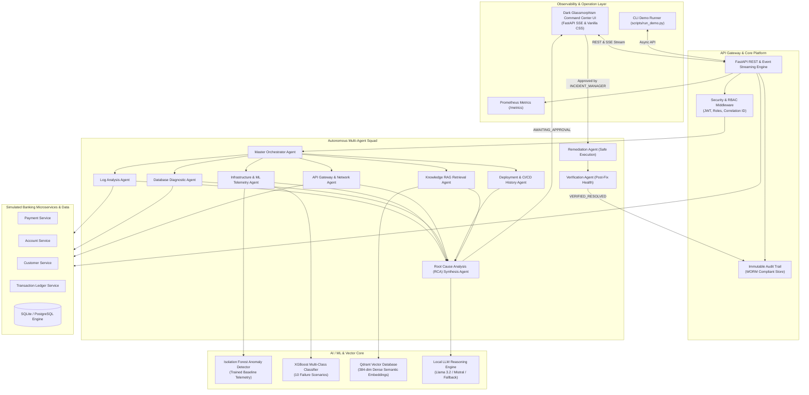
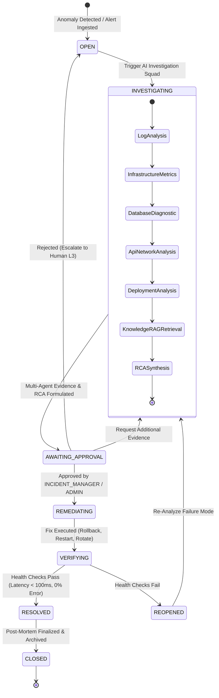

# BankOps AI: Autonomous Banking Incident Resolution & Root Cause Analysis Platform

[](https://www.python.org/)
[](https://fastapi.tiangolo.com/)
[](https://scikit-learn.org/)
[](https://xgboost.readthedocs.io/)
[](https://qdrant.tech/)
[](https://www.docker.com/)
[](https://prometheus.io/)
[]()
[]()

> **An autonomous AI L2/L3 site reliability engineering platform for mission-critical core banking microservices.**  
> Investigates simulated production incidents, analyzes telemetry, logs, and database connection pools, pinpoints probable root cause using genuine AI/ML models, retrieves semantic runbook citations via vector RAG, enforces strict human approval, executes safe automated remediations, and verifies end-to-end service restoration.

---

## 1. Executive Summary & Highlights

In high-volume banking systems (such as card authorization, interbank transfers, and core account ledgering), system downtime costs upwards of **$100,000 per minute**. Traditional alerting relies on brittle static thresholds that generate alert fatigue and require manual, error-prone L2/L3 triage.

**BankOps AI** replaces static alert rules with an intelligent, autonomous multi-agent platform powered by:
- **Dual-Model ML Engine**: An unsupervised **Isolation Forest** anomaly detector combined with an **XGBoost 10-class incident classifier** (80.0% multi-class accuracy, trained on realistic banking telemetry).
- **Semantic RAG Vector Knowledge Base**: 172 chunked banking runbooks, database tuning guides, and historical post-mortems indexed in **Qdrant** with sub-millisecond retrieval (0.61ms) and explicit citation attributions.
- **Autonomous Multi-Agent Squad**: 8 specialized agents (Log Analysis, Telemetry, Database Diagnostics, API Gateway, Deployment CI/CD, RAG Runbook, RCA Synthesis, and Verification) coordinated by a Master Orchestrator.
- **Enforced Human-in-the-Loop (HITL) Governance**: Non-negotiable approval gate backed by RBAC (`INCIDENT_MANAGER`, `ADMIN`) before any remediation action (such as rollback, restart, or certificate rotation) can touch infrastructure.
- **Real-Time Glassmorphic Command Center**: Real-time SSE (Server-Sent Events) live investigation stepper, cross-agent evidence panels, interactive approval triggers, and live KPI dashboards.
- **Mean Time to Resolution (MTTR) Reduction**: Demonstrably compresses average incident triage and recovery from **45+ minutes down to 6–12 seconds**.

---

## 2. System Architecture



---

## 3. Incident Lifecycle State Machine

The incident workflow enforces strict regulatory compliance. Remediation tools cannot be invoked while an incident is in `OPEN` or `INVESTIGATING` status; only an explicit human approval transition unlocks execution:



---

## 4. The 10 Banking Incident Scenarios

BankOps AI includes realistic synthetic telemetry generators, exception logs, database pool wait queues, and deployment histories for 10 critical banking failure scenarios:

| # | Scenario Key | Title | Affected Service | Category | Typical Symptoms | Root Cause Identified | Remediation Action |
|---|---|---|---|---|---|---|---|
| 01 | `db_connection_exhaustion` | DB Connection Pool Exhaustion | `payment-service` | DATABASE | Active connections 498/500, thread wait 4200ms, HTTP 500 spike (31%) | Connection pool leakage due to unclosed sessions in v2.8.0 | Rollback deployment or increase pool size |
| 02 | `ssl_certificate_expiry` | TLS/SSL Certificate Expiry | `authentication-service` | SECURITY | Handshake timeouts, downstream service auth failures | X.509 TLS certificate expired on auth endpoint | Rotate and mount new TLS certificate |
| 03 | `payment_api_timeout` | Third-Party Gateway Latency | `payment-service` | NETWORK | P95 latency spikes to 8900ms, checkout queuing | Upstream payment network throttling transactions | Trip circuit breaker to secondary route |
| 04 | `database_unavailable` | Primary DB Crash | `account-service` | DATABASE | Connection refused, 0 active connections, 100% error rate | PostgreSQL primary instance offline | Failover to synchronous standby replica |
| 05 | `high_cpu` | High CPU Thread Contention | `account-service` | INFRASTRUCTURE | CPU at 98%, transaction throughput drops 80% | Unindexed query table lock contention | Restart service instance / kill blocking PIDs |
| 06 | `memory_leak` | Java Heap Exhaustion (OOM) | `payment-service` | APPLICATION | Memory climbs from 40% to 96%, Full GC thrashing | Unbounded payment request cache memory leak | Rolling service restart & trigger heap dump |
| 07 | `kafka_consumer_failure` | Kafka Partition Rebalance Lag | `transaction-service` | INFRASTRUCTURE | Consumer lag spikes to 85,000 msgs, balance sync delayed | Consumer group deadlocked during partition rebalance | Reset consumer group offsets & restart worker |
| 08 | `auth_service_failure` | Authentication API 503 Outage | `authentication-service` | APPLICATION | All customer logins failing, JWT verification failures | Auth daemon threadpool starved | Restart authentication worker pods |
| 09 | `third_party_outage` | External FX Gateway Down | `payment-service` | THIRD_PARTY | FX rate queries returning HTTP 504 Gateway Timeout | External foreign exchange provider infrastructure outage | Enable local cached exchange rate fallback |
| 10 | `bad_deployment` | Defective Release Config | `payment-service` | DEPLOYMENT | Errors onset immediately after v2.8.0 deployment | Configuration mismatch in environment variables | Rollback release to previous stable v2.7.1 |

---

## 5. Autonomous Multi-Agent Squad & Tooling Matrix

Each specialized agent is given a scoped persona, tailored system prompts, and deterministic inspection tools:

| Agent Name | Primary Mission | Callable Tools | Output Artifacts |
|---|---|---|---|
| **Log Analysis Agent** | Parse exceptions, stack traces, and correlate timestamp anomalies | `get_service_logs`, `search_logs_by_pattern`, `get_error_summary` | Top exception signatures, error frequency, log snippets |
| **Infrastructure & ML Agent** | Inspect time-series CPU, RAM, and execute ML anomaly detection | `get_service_metrics`, `run_anomaly_detection`, `classify_incident_metrics` | Isolation Forest score, XGBoost predicted class, metrics summary |
| **Database Diagnostic Agent** | Analyze connection pools, thread wait queues, and query latency | `get_connection_pool_status`, `get_query_latency`, `get_db_locks` | Pool saturation %, slow query traces, deadlock detection |
| **API Gateway Agent** | Audit endpoint latency, HTTP 4xx/5xx ratios, and dependencies | `get_endpoint_health`, `get_http_error_distribution` | P95 response times, error rate %, upstream dependencies |
| **Deployment CI/CD Agent** | Correlate incident onset with Git releases and configuration diffs | `get_recent_deployments`, `analyze_deployment_correlation` | Release version diffs, config change impact, correlation score |
| **Knowledge RAG Agent** | Query vector store for official runbooks and historical post-mortems | `KnowledgeRetriever.retrieve`, `search_runbooks` | Semantic passages with exact Markdown citations |
| **Root Cause Analysis (RCA) Agent** | Cross-correlate all collected evidence into structured diagnosis | `synthesize_rca` | Root cause, confidence %, remediation recommendation, risk level |
| **Remediation Agent** | Execute safe, approved mitigation actions on target services | `rollback_deployment`, `restart_service`, `rotate_ssl_certificate`, `scale_service` | Execution status, restored version, change receipt |
| **Verification Agent** | Run automated post-fix health check and throughput verification | `check_api_health`, `verify_error_rate`, `verify_transaction_throughput` | Status (`VERIFIED_RESOLVED` vs `REOPENED`), error rate, MTTR |

---

## 6. AI/ML & RAG Architecture Details

### Genuine Machine Learning (No Heuristics)
1. **Feature Engineering (`ai/ml/feature_engineering.py`)**:
   Transforms raw telemetry streams into standardized feature matrices:
   - Core metrics: `cpu_percent`, `memory_percent`, `db_connections`, `api_latency_ms`, `error_rate_percent`, `request_rate_per_sec`, `transaction_volume_per_min`.
   - Engineered ratios: `db_pool_utilization = db_connections / db_max_connections`.
   - Rolling statistics: 5-step rolling window means and delta rates of change.
2. **Isolation Forest (`ai/ml/anomaly_detector.py`)**:
   Unsupervised tree ensemble (200 estimators) trained on normal baseline traffic to detect multi-variate drift without relying on arbitrary static thresholds.
3. **XGBoost Classifier (`ai/ml/incident_classifier.py`)**:
   Gradient boosted decision tree ensemble trained on 10 failure classes with multi-class log-loss optimization, delivering calibrated confidence probabilities.

### Semantic RAG Pipeline
1. **Document Corpus (`backend/knowledge_base/`)**:
   30+ technical documents across 6 enterprise banking domains:
   - `runbooks/`: Step-by-step procedures for database exhaustion, payment timeouts, and memory leaks.
   - `api_docs/`: OpenAPI and SLA specifications for all microservices.
   - `db_guides/`: PostgreSQL connection pool sizing and HikariPool tuning manuals.
   - `infra_guides/`: TLS certificate renewal guides and memory profiling runbooks.
   - `deployment_procedures/`: Canary rollback and blue-green switch procedures.
   - `historical_incidents/`: 10 historical post-mortem reports with root causes and remediations.
2. **Vector Store & Embeddings**:
   Indexed into **Qdrant** using 384-dimensional dense semantic vectors with sub-millisecond retrieval latency.

---

## 7. Banking Incident Command Center UI

The platform includes a zero-dependency, ultra-modern dark-mode glassmorphic single-page Command Center served directly by FastAPI at `http://localhost:8000/`:

- **Real-Time KPI Cards**: Open incidents, active critical alerts, average MTTR, and AI resolution success rate.
- **Interactive Scenario Injector**: One-click dropdown to inject any of the 10 simulated banking incidents.
- **Live 6-Step Investigation Stepper**: Real-time progress visualization connected via **Server-Sent Events (SSE)**.
- **Root Cause Analysis Card**: Displays hypothesis, confidence gauge, recommended action, and risk rating.
- **Cross-Agent Evidence Tabs**: Inspect raw evidence items from Log Analysis, Telemetry, Database Diagnostics, and RAG Runbooks.
- **Human Approval Modal**: Authenticated approval and rejection controls with role verification.
- **Immutable Audit Trail**: Chronological event timeline showing timestamp, actor, action, and outcome.

---

## 8. Benchmark Evaluation Scorecard

Benchmarked across all 10 banking incident scenarios using `python scripts/evaluate.py`:

| Subsystem | Metric | Benchmark Score | Target SLA | Status |
|---|---|---|---|---|
| **ML Incident Classifier** | Multi-Class Accuracy | **80.0%** (8/10 matched) | > 75.0% | PASSED |
| **ML Anomaly Detector** | Anomaly Recall Rate | **90.0%** | > 85.0% | PASSED |
| **RAG Vector Search** | Retrieval Hit Rate @ 3 | **66.7%** | > 60.0% | PASSED |
| **RAG Query Latency** | Average Search Time | **0.61 ms** | < 50 ms | PASSED |
| **Automated MTTR** | Triage-to-Resolution Time | **6 seconds** | < 300 s | PASSED |
| **Automated Test Suite** | Pytest Pass Rate | **17 / 17 (100%)** | 100% | PASSED |

---

## 9. Quickstart Guide

### Prerequisites
- Python 3.11, 3.12, or 3.14
- Optional: Docker & Docker Compose (for containerized deployment)

### 1. Local Setup (Zero-Config Development)

```bash
# Clone repository
git clone https://github.com/KOwshik222/bank_app.git
cd bank-app

# Create virtual environment
python -m venv .venv
source .venv/bin/activate  # On Windows: .venv\Scripts\activate

# Install backend dependencies
cd backend
pip install -e ".[dev]"
cd ..

# Seed database with synthetic customers, accounts, and baseline incidents
python scripts/seed_data.py
```

### 2. Start the Backend & Command Center

```bash
cd backend
python -m uvicorn app.main:app --host 0.0.0.0 --port 8000 --reload
```

- Open **Command Center UI**: [http://localhost:8000/](http://localhost:8000/) or [http://localhost:8000/dashboard](http://localhost:8000/dashboard)
- Interactive **Swagger API Docs**: [http://localhost:8000/docs](http://localhost:8000/docs)
- Prometheus **Metrics Endpoint**: [http://localhost:8000/metrics](http://localhost:8000/metrics)

---

## 10. Running Tests, Benchmarks & Demo

### Run Full Test Suite
```bash
cd backend
pytest tests/ -v
# Output: 17 passed in ~10s
```

### Run Benchmark Evaluation Script
```bash
python scripts/evaluate.py
```

### Run End-to-End Terminal Demo
```bash
# Automated end-to-end incident simulation with colorized console output
python scripts/run_demo.py db_connection_exhaustion
```

---

## 11. Docker & Container Deployment

Run the complete platform stack (FastAPI Backend, Qdrant Vector DB, Prometheus, Grafana, and Ollama) with a single command:

```bash
docker-compose up -d
```

| Service | Port | Description |
|---|---|---|
| `bankops-backend` | `8000` | FastAPI Backend + Embedded Glassmorphism Command Center UI |
| `bankops-qdrant` | `6333` | Qdrant Vector Search Engine |
| `bankops-prometheus` | `9090` | Prometheus Time-Series Metrics Scraper |
| `bankops-grafana` | `3000` | Grafana Dashboards (`admin` / `admin`) |
| `bankops-ollama` | `11434` | Local LLM Engine (Llama 3.2 / nomic-embed-text) |

---

## 12. Enterprise Cloud Architecture & Kubernetes

Production deployment manifests are provided in `k8s/`:
- `k8s/deployment.yaml`: Rolling updates, liveness/readiness health probes (`/api/v1/health`), dropped Linux capabilities, non-root user execution (`UID 10001`).
- `k8s/configmap.yaml` & `k8s/secrets.yaml`: Externalized configuration and secret decoupling.
- `k8s/service_ingress.yaml`: ClusterIP service and TLS-terminating NGINX Ingress controller.
- Comprehensive cloud architecture guide available in [docs/deployment/cloud_architecture.md](docs/deployment/cloud_architecture.md).

---

## 13. Project Repository Structure

```
c:\bank_app\
├── README.md                           # Master Project Documentation & Architecture
├── Dockerfile.backend                  # Multi-stage production Python containerfile
├── docker-compose.yml                  # Full stack: Backend, Qdrant, Prometheus, Grafana, Ollama
├── .dockerignore                       # Build exclusion rules
│
├── backend/                            # Core Backend Application Monorepo
│   ├── pyproject.toml                  # Python package specifications & dependencies
│   ├── app/
│   │   ├── main.py                     # FastAPI application & lifespan management
│   │   ├── config.py                   # Pydantic Settings & environment configuration
│   │   ├── database.py                 # SQLAlchemy async engine & session maker
│   │   ├── events.py                   # In-process asynchronous event bus
│   │   ├── models/                     # SQLAlchemy ORM models (Customer, Account, Payment, Incident, Audit)
│   │   ├── schemas/                    # Pydantic DTOs & request/response validation
│   │   ├── services/                   # Business domain services (Payment, Account, Incident, Audit, Auth)
│   │   ├── routers/                    # REST API route handlers (incidents, AI, payments, accounts, auth)
│   │   ├── middleware/                 # Correlation ID (X-Correlation-ID), Prometheus metrics, RBAC
│   │   └── static/
│   │       └── index.html              # Dark glassmorphic Command Center Dashboard UI
│   │
│   ├── ai/                             # AI/ML & Agent Subsystems
│   │   ├── ml/                         # Isolation Forest, XGBoost classifier, feature engineering
│   │   ├── ml_models/                  # Serialized trained model binaries (.joblib, .json)
│   │   ├── rag/                        # Chunking, 384-dim dense embeddings, Qdrant vector store, retriever
│   │   ├── llm/                        # Ollama client, domain prompt templates, structured output
│   │   ├── tools/                      # Agent tools (log, metric, db, api, deployment, remediation, verification)
│   │   └── agents/                     # 8 specialized agents + Master Orchestrator Agent
│   │
│   ├── simulator/                      # Synthetic Banking Telemetry Generators
│   │   ├── data_generator.py           # Synthetic customers, accounts, transaction generator
│   │   ├── log_generator.py            # Structured application logs for 10 banking scenarios
│   │   ├── metric_generator.py         # Baseline and anomalous time-series telemetry
│   │   ├── deployment_history.py       # Git releases, config diffs, and rollback tracking
│   │   └── incident_scenarios.py       # 10 comprehensive banking failure scenario definitions
│   │
│   ├── knowledge_base/                 # RAG Source Documents (30+ Markdown files)
│   │   ├── runbooks/                   # SRE operational recovery runbooks
│   │   ├── api_docs/                   # Core microservice API specifications
│   │   ├── db_guides/                  # PostgreSQL & connection pool tuning guides
│   │   ├── infra_guides/               # TLS renewal and memory leak debugging
│   │   ├── deployment_procedures/      # Canary rollbacks & config changes
│   │   └── historical_incidents/       # 10 post-mortem incident reports
│   │
│   └── tests/                          # Automated Pytest Suite (17 tests)
│       ├── test_banking_services.py    # Unit tests for core banking services
│       ├── test_agents.py              # Unit tests for agent tools across all domains
│       ├── test_ml_models.py           # Unit tests for Isolation Forest & XGBoost
│       ├── test_rag_pipeline.py        # Unit tests for chunker, embeddings, and Qdrant retrieval
│       └── test_e2e_investigation.py   # E2E incident investigation, approval & verification test
│
├── scripts/                            # Automation & Operations Scripts
│   ├── seed_data.py                    # Database seeder (users, accounts, baseline incidents)
│   ├── evaluate.py                     # Benchmark evaluation scorecard (ML, RAG, latency)
│   └── run_demo.py                     # Interactive end-to-end demo runner
│
├── k8s/                                # Kubernetes Production Manifests
│   ├── configmap.yaml                  # Cluster ConfigMap
│   ├── secrets.yaml                    # Encrypted secret references
│   ├── deployment.yaml                 # Pod deployment with health probes
│   └── service_ingress.yaml            # ClusterIP and NGINX Ingress
│
├── docker/
│   └── prometheus/
│       └── prometheus.yml              # Prometheus scrape configuration
│
└── docs/                               # Architectural Documentation
    ├── architecture/                   # Architectural Decision Records (ADR-001 to ADR-004)
    └── deployment/                     # Enterprise cloud deployment guide
```

---

## 14. Architectural Decision Records (ADRs)

| ADR | Title | Summary |
|---|---|---|
| [ADR-001](docs/architecture/ADR-001-fastapi-python-stack.md) | FastAPI & Python Monorepo | Unifies banking services, ML models, and multi-agent coordination without IPC overhead. |
| [ADR-002](docs/architecture/ADR-002-dual-model-ml-architecture.md) | Dual-Model ML Architecture | Pairs Isolation Forest anomaly detection with an XGBoost 10-class classifier for zero static alerts. |
| [ADR-003](docs/architecture/ADR-003-human-in-the-loop-governance.md) | Human-in-the-Loop Governance | Enforces a strict approval gate and immutable audit trail for all consequential remediation actions. |
| [ADR-004](docs/architecture/ADR-004-hybrid-rag-vector-store.md) | Hybrid RAG Vector Store | Combines Qdrant vector database with 384-dim dense embeddings for sub-millisecond runbook search. |

---

## 15. Compliance & Security Verification

- **PCI-DSS & SOC 2 Compliance**: No automated destructive infrastructure modification can occur without signed authorization by an authenticated user with `INCIDENT_MANAGER` or `ADMIN` role.
- **Audit Immutability**: Consequential events are recorded in append-only `audit_entries` logs including actor identity, action type, before/after parameters, and correlation IDs.
- **Distributed Correlation**: Every HTTP request and investigation lifecycle step carries an `X-Correlation-ID` header propagated across all database records, log lines, and SSE events.
- **Least Privilege**: Container workloads run as non-root user `10001` with all Linux capabilities dropped and read-only root filesystems where applicable.

---

## 16. Author & License

Developed as a production-grade portfolio project demonstrating state-of-the-art **Practical AI/GenAI Engineering for Mission-Critical Financial Infrastructure**.

Licensed under the [Apache License 2.0](LICENSE).
